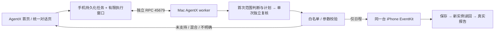

# AgentX

独立的 iPhone 助手工作台：**全能助手判断能力，日程助手在手机上创建日历事项。** 当前仅支持新建日程；邮件、短信显示“即将推出”。原 PhoneAgent 的工程、App、启动入口和记录保持独立。

## 安装与日常使用

1. 用 Xcode 打开 `AgentX.xcodeproj`，选择 **AgentX target → Signing & Capabilities → Team**。在被 Git 忽略的 `Signing.local.xcconfig` 中设置 `DEVELOPMENT_TEAM` 和独立 `PRODUCT_BUNDLE_IDENTIFIER`，例如 `com.yourname.AgentX`；不要使用旧 PhoneAgent 的标识。选择真实 iPhone 后运行。不要删除旧 App。
2. Mac 沿用 Wellphone 根目录已配置的 `.env`；不存在时在根目录运行 `python3 scripts/configure_model.py`，只在本机输入 Key。
3. 双击本目录的 **`启动 AgentX.command`**；终端等价命令：`python3 scripts/start_agentx.py`。保持窗口开启、Mac 不休眠和手机连接。`Control+C` 只停止该窗口启动的服务。
4. 手机打开 **AgentX → 右上角设置 → 准备连接和日历权限 → 允许完全访问**。新 App 不继承旧授权；完全访问用于独立读回。
5. 返回首页，选择全能助手或日程助手，输入后点发送。可留在前台，也可切回游戏/聊天；回来查看任务卡片与报告。测试模式默认开启，事件前缀为 `AgentX Test`。

配置：`OPENAI_API_KEY` 必需；`WELLPHONE_MODEL` 默认 `gpt-4.1-mini`；`HTTPS_PROXY` 可选。优先读取进程环境，再读取本目录 `.env`，最后只读父目录 `.env`。不复制 Key。端口统一在 `AgentXConfig.plist`，修改后须重建 App 并重启 AgentX 服务。默认拒绝旧端口 45678。

## 验证与边界

- 自动检查：`bash scripts/test.sh`；可选真实模型合成输入测试：`python3 scripts/check_model.py --live`（产生 API 费用，不访问手机）。
- 新服务、转发器、锁、`data/`、`.runtime/`、手机沙盒及账本独立；不会自动导入或重跑旧记录。原始日志和任务仅留本机。
- 单次窗口最多 45 秒，系统可提前终止后台执行；并非永久后台服务，仍需 Mac。模型总预算 22 秒，只有一次复核。
- 混合请求整体不执行，请将日程部分单独提交。模型判断可能出错；未知执行结果不自动重建。去重按同一任务/事项 ID 持久化，不跨 App 去重，也不将重新提交相同文本视为同一任务。
- 重复、全天、跨天、备注、链接和提醒沿用当前快照；**未恢复已回退的日期编译器/全天边界修复**。旧版测试不等于 AgentX 真机验证，详见 [验证记录](docs/validation.md)。

[设计与扩展](docs/architecture.md) · [复用来源](SOURCE_SNAPSHOT.json) · [上游 MIT 许可](LICENSE.PhoneAgent) · [首页预览](evidence/home-preview.png) · [对话预览](evidence/chat-preview.png)
