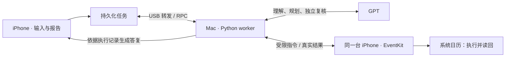

# AgentX

**把计划交给助手，继续使用手机。** AgentX 是 SwiftUI 构建的 iPhone 助手工作台：全能助手判断请求范围，日程助手在同一台手机上查询、创建、修改和删除日历事项，并根据真实执行记录给出自然语言答复。当前交付日程模块，邮件、短信等模块尚未实现。



## 关键决策：用 EventKit 完成手机侧执行

- **不争抢屏幕和键盘。** 日程操作通过 iPhone 原生 EventKit 接口执行，不需要打开日历 App、模拟点击或输入。用户的前台游戏与助手的数据操作分离；早期 XCTest 实验出现的 Automation Running 水印和变暗促使项目改用原生宿主。
- **模型判断，接口落实。** 模型理解需求、选择时间、补齐合理缺省并独立复核；代码负责权限、参数、冲突检查、持久化去重和执行。保存成功与读回验证分开记录，模型的“已完成”不能代替真实结果。读回与查询需要日历完全访问权限。
- **明确运行边界。** 日历保存由这台 iPhone 完成，Mac 承担模型请求和任务协调。原生 App 使用有限后台执行窗口，不是永久后台服务器，也不等于能后台控制任意第三方 App。

## 能力

自然语言创建与连续对话改删；最长一年范围查询、冲突检查、基于真实空档自动排程；重复规则、全天/跨天、备注与链接、自适应提醒。可查看自动补齐和仍缺失的信息、逐项保存/验证结果。答复失败可单独重新生成，不重做已执行的日历操作。自动择时支持最多 8 个单次事项，暂不支持重复事项自动择时。

## 安装与一键启动

需要 macOS、Xcode、Python 3.10+、iOS 18+ 真机及 OpenAI API Key。

```bash
git clone https://github.com/arielz37/AgentX.git
cd AgentX
open AgentX.xcodeproj
python3 scripts/configure_model.py
```

1. 手机连接 Mac，完成信任、Developer Mode 与 Xcode 配对。在本机新建 `Signing.local.xcconfig`，填写 `DEVELOPMENT_TEAM = 你的 Team ID`、`PRODUCT_BUNDLE_IDENTIFIER = com.yourname.AgentX`；在 Xcode 的 **AgentX target → Signing & Capabilities** 检查签名，选择 iPhone 运行。
2. 上述配置脚本在终端隐藏输入 Key，保存到仅本机的 `.env`。已有配置无需重建。
3. 日常双击根目录 **`启动 AgentX.command`**，或运行 `python3 scripts/start_agentx.py`。保持终端开启、Mac 不休眠及手机连接；`Control+C` 停止该窗口启动的服务。
4. 手机 **AgentX → 设置 → 准备连接和日历权限 → 允许完全访问**。选助手、输入、发送；可留在前台，也可切回游戏或聊天，之后查看报告。测试模式默认开启，事件带 `AgentX Test` 前缀。

| 配置 | 说明 |
|---|---|
| `OPENAI_API_KEY` | 必需，仅在 Mac 配置 |
| `AGENTX_MODEL` | 可选，默认 `gpt-4.1-mini` |
| `HTTPS_PROXY` | 可选，使用本机已有代理 |
| `AgentXConfig.plist` | RPC 默认端口 `45679`；修改后重建 App、重启服务 |

进程环境优先于本项目 `.env`，不读取父目录配置。任务相关原文、近期对话摘要及所需日历结果会经 Mac 发送给配置的模型服务；密钥、签名、原始记录与设备日志不入 Git。

## 验证与限制

运行 `bash scripts/test.sh` 可离线执行 Python、Swift 和 EventKit 替身检查。前台单次窗口最长 5 分钟，切到后台后最多 45 秒，系统可提前结束；超时任务需用户主动继续。模型可能误判，未知执行结果不自动重建；去重覆盖同一任务/事项 ID 的重试，不覆盖重新提交相同文本。已有真机验收与本次迁移回归分别记录，不能用编译或模型测试代替后台使用验收。

[架构与扩展](docs/architecture.md) · [功能与验证导航](docs/validation.md) · [整合说明](docs/repository-consolidation.md) · [复用来源](SOURCE_SNAPSHOT.json)

RPC 传输与设备转发代码复用并改编自 [Rounak / PhoneAgent](https://github.com/rounak/PhoneAgent)，保留 [MIT 许可](LICENSE.PhoneAgent)。当前源码独立交付，无旧项目或 Git submodule 依赖。
