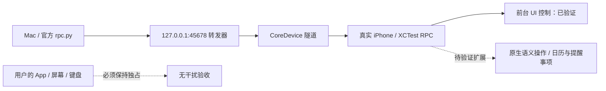

# Wellphone

探索用户正常使用手机时，Agent 在同一台手机完成真实任务且不抢屏幕、焦点与键盘。

**当前状态：Day 1 真机控制基线已通过；无干扰并行执行尚未实现。** 现有 UI 自动化会操作前台，不能作为最终题目的完成证明。优先复用 [PhoneAgent](https://github.com/rounak/PhoneAgent)，不重写设备 bridge。



## 部署 Day 1 基线

需要 macOS、Xcode、Python 3、USB 连接的真实 iPhone。本次验证为 macOS 15.6.1 / Xcode 26.2 / Python 3.14.2 / iOS 26.6.1。

```bash
git clone --recurse-submodules https://github.com/arielz37/Wellphone.git
cd Wellphone/PhoneAgent
open PhoneAgent.xcodeproj
```

在 Xcode 为 `PhoneAgent` 和 `PhoneAgentUITests` 两个 Target 的 **Signing & Capabilities** 选择自己的 Team，并使用唯一 Bundle IDs。手机启用 **设置 → 隐私与安全性 → 开发者模式**；在 **设置 → 通用 → VPN 与设备管理** 信任开发者 App。自动化期间保持解锁、亮屏。

```bash
# 终端 A：选择列表中的真实 iPhone，等待 PHONEAGENT_RPC_READY
./.agents/skills/phoneagent/scripts/start_rpc_bridge_local.sh
# 终端 B：同样进入 PhoneAgent 目录
./.agents/skills/phoneagent/scripts/rpc.py open-app com.apple.Preferences
./.agents/skills/phoneagent/scripts/rpc.py get-tree
./.agents/skills/phoneagent/scripts/rpc.py get-screen-image --print-metadata
# 完成后正常结束
./.agents/skills/phoneagent/scripts/rpc.py stop
```

## 环境变量与范围

无需 API Key。可选 `PHONEAGENT_DEVELOPMENT_TEAM`（多 Team 时指定），`PHONEAGENT_DEVICE_DISCOVERY_TIMEOUT`（默认 5 秒）。RPC 默认 `127.0.0.1:45678`；客户端支持 `--host` / `--port`。CoreDevice 是本次实测路径；仅 USB 回退需要仓库文档中的 `pymobiledevice3`。

已验证：设备发现、UI Tree、截图、打开 Settings、点击、输入、滑动。最终会话约 5 分钟，22 次连接，XCTest 0 failures；不代表长期或并行稳定性。见 [验收记录](docs/day1.md)、[路线分析与下一步](docs/next-steps.md)。原始日志与本地签名配置不上传。

`PhoneAgent/` 是固定到 `4f0e201` 的 Git submodule，保留上游代码、历史和 MIT 许可。克隆已有仓库后可运行 `git submodule update --init --recursive` 获取源码。本项目的当前贡献是环境集成、验证和架构决策，未将上游实现标为原创。

