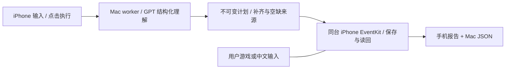

# Wellphone

在同一台 iPhone 上输入计划、点执行、切回游戏；Mac 的 GPT 判断合理补齐与重要空缺，iPhone 用 EventKit 创建可执行事项并独立读回，回来查看真实报告。复用 [PhoneAgent](https://github.com/rounak/PhoneAgent) 的 RPC 与设备转发。

**Day 3 已真机验收：真实 GPT 解析后，用户玩王者时 4 项保存并验证；中文输入时混合计划 2 项完成、2 项重要信息不足未创建。连同手动继续场景，本轮新增 10 条，用户确认日历正确、无重复，游戏和输入体验正常。** 后台窗口有限，不能长期后台待命；没有录像/帧率结论。



**自适应提醒更新：已实现并通过编译、离线回归和四组真实模型测试；真机前台三项事件与提醒已保存并独立读回；后台与通知触发尚待验收。** 旧任务保持无提醒。[规则与测试](docs/adaptive-alerts.md)。

## 启动

**日常使用：连接并解锁 iPhone，双击项目根目录的 [启动 Wellphone.command](启动%20Wellphone.command)，再手动打开手机 Wellphone。** 自动启动或复用转发器与 worker；使用期间保持服务窗口开启、Mac 不休眠。[详细说明与排错](docs/launcher.md)。

首次部署需要 Xcode、Python 3.10+、已配对真机及 Mac 本地 OpenAI API Key：

```bash
git clone --recurse-submodules https://github.com/arielz37/Wellphone.git
cd Wellphone
bash scripts/apply_phoneagent_patch.sh
open PhoneAgent/PhoneAgent.xcodeproj  # 为 targets 配置自己的 Signing
python3 scripts/configure_model.py   # 隐藏输入 Key，保存在忽略的 .env
xcrun xctrace list devices
python3 scripts/start_native_host.py --udid <实际真机UDID>
# 另一个终端：
python3 scripts/wellphone_worker.py
```

安装启动仅在准备阶段进行，会打开宿主。手机点“准备连接和日历权限”，首次允许完全访问；在测试模式输入计划、点执行；可留在前台等待，也可切回游戏继续执行。无需逐项确认。回来打开执行报告，最后手动核对日历。

## 配置与边界

`.env.example`：`OPENAI_API_KEY`、可选 `WELLPHONE_MODEL`（默认 `gpt-4.1-mini`）和 `HTTPS_PROXY`；密钥仅 Mac。RPC `127.0.0.1:45678`。最多 8 项、未来定时事件，支持用户指定或模型建议的最多两次时间提醒；暂不支持全天/邀请/位置提醒。系统可提前结束 45 秒应用窗口；过期保留计划，需用户主动继续。无 XCTest、音频保活或前台自动化回退。持久化防重不等于严格恰好一次；未知结果禁止自动重建。原始输入、日志、事件 ID 与个人签名仅保留本机。

[Day 3 实测报告](docs/day3-report.md) · [部署与限制](docs/day3.md) · [Day 2 真实证据](docs/day2.md) · [Day 1 基线](docs/day1.md)

上游固定 `4f0e201572c2cc6f36bab1e1f80c61878b4a90b7`，保留 MIT 归属。源码通过 `patches/phoneagent-alerts.patch` 和配置脚本复现，无不可获取的 submodule 提交。验证：`python3 -m unittest discover -s tests -p 'test_*.py'`。
