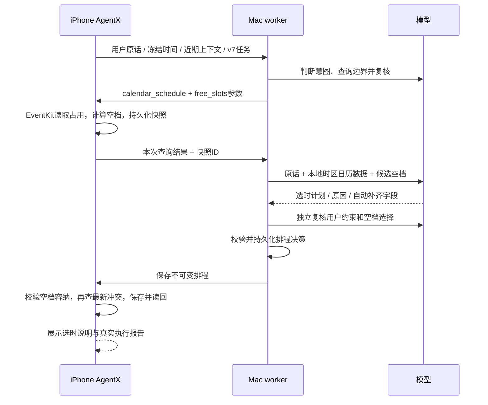

# 读取日历后自动排程

用户可以说：“下周帮我找个空闲时间安排一小时练琴，不用提醒。”不需要先问空档，再手动复制具体时间。普通“下周什么时候有空”仍是只读查询；固定时间的创建保持原链路。

## 处理流程



首轮模型还提取逐项事项清单与时间决定权；手机保存后不可变。第二轮的事项ID、标题和数量必须与清单一致，不能在解释里说两项、实际计划只含一项。`external_unknown` 时间不允许进入自由排程。清单语义来自模型，仍依赖理解和复核，不能宣称完全杜绝语义错误。

模型选择时间，代码不选择“第一个空档”或拼接排程回答。代码负责接口范围、区间运算、时长校验、权限及真实执行状态。手机与 Mac 双重校验：选时必须在快照候选空档中、时长必须等于查询要求、同批事项不能重叠、自动选时须标为 `defaulted`，不能伪装成用户明确给出的时间。

模型的 `message` 是选时解释，不能宣称已创建；执行状态另由 EventKit 保存与读回决定。地点等未知信息仍保留空缺。查询默认条件、模型选时理由、字段来源、实际保存时间、读回结果和冲突均可查看。原始日历数据只取本次范围，经 Mac 交给已配置模型；本机记录不提交 Git。

## 边界与恢复

- RPC 协议5，新任务v7；手机和 Mac worker 必须同时更新。历史任务不重新路由或执行；新提交附同助手最近六轮摘要。
- 单次查询最多一个日历年，新 v7 提供最多2000条发生明细及2000个候选区间；空档计算使用完整占用集合，沿用节假日与用户日历忙闲偏好。存在截断时不能宣称全范围最优。
- 本版支持一个连续日期范围、每天同一连续时段、每项同一时长（15–180分钟）、最多8个单次定时事项；也支持按当地完整日期选取1天或连续多天的全天事项。未给时长/时间段时模型可给合理默认并披露。重复、定时跨天自动择时、不同事项不同窗口/时长、复杂日期筛选需分开或澄清；原固定时间创建的重复/全天等功能保留。
- 已预约课程、就诊、交通和真实截止时刻等关键事实不能用空档冒充；模型应要求补充。语义判断仍可能出错，不宣称绝对可靠。
- 无可用候选、容量不够或无法满足约束时，不生成写入计划，提供模型说明。批量不够时不静默丢弃事项。保存前出现新的冲突则阻止该项，其余项可独立成功，报告如实显示部分完成；本版不自动多轮重排。
- 快照不等于预留。写入前重新查询，缩小读取与写入之间的竞争窗口，但 EventKit 没有“检查空闲并保存”的跨应用原子锁，不能保证外部并发写入完全无冲突。
- 仍是原45秒有限窗口；首次理解/复核共22秒，选时/复核共16秒。系统可提前暂停后台，额外模型步骤增加超时机会，不能保证每次都在游戏期间完成。
- 手机暂停后 Mac 可完成排程并持久化；回来只投递同一决策。窗口已过时显示“继续执行这份计划”，用户主动点击才写入，并重新检查冲突。自动投递不重新开启窗口。
- 查询与写入分阶段记录发送状态。同一查询响应丢失时只取已存快照；排程投递丢失时只投递同一决策；写入响应未知时不盲目重发。模型处理中进程崩溃且未保存结果会明确失败，不自动再次生成可能不同的计划。
- 复用原手机持久化账本，覆盖同一任务/事项ID的重试；重新发送原文是新任务，不属于全局文本去重。

## 验证

当前 v7 全天排程验证及限制见 [本轮交付](calendar-editing.md)。下列真机记录属于此前 v6，不代替新版验收。

```sh
bash scripts/test.sh
# 可选：只向模型发送合成数据，不连接手机或创建事件
python3 scripts/check_scheduling.py --live
```

自动测试覆盖路由隔离、真实空档容纳、时长和来源校验、批内相邻/冲突、无空档、旧任务拒绝、模型实际收到接口数据、计划持久化与重复投递、过期窗口不自动开启、写入响应丢失不重发、模型进程中断不重试。已有 EventKit 替身测试验证新占用阻止保存及持久化去重。

待真机安装后验收：在测试模式发送单条安排，查看实际保存/读回；再在游戏中提交另一测试事项；核对没有覆盖旧日程、自动补齐与选时理由可见。测试日期必须在执行当天之后，不自动删除旧测试事件。

2026-09-30：54项 Python 测试、7组 Swift 校验、2组 EventKit 替身通过，真机签名构建通过。真实模型最终选时测试4/4通过（单项、两项、无空档、不可信标题），路由复验3/3通过（自动安排、只读查询、外部预约时间未知），证据见 `../evidence/scheduling-model-probes.json` 与 `../evidence/scheduling-route-review-probes.json`。

开发中曾出现漏项、外部预约误路由、以及复核声明纠正却没有任何改动的错误。清单契约阻止遗漏/换项；查询专用复核去掉无关创建字段后，原查询失败样本复验通过。保留初轮失败结果，有限样本不保证模型始终正确。

2026-09-30 已安装自动排程版 AgentX，独立 Mac 服务已重启；真机确认 `app_id=agentx`、RPC协议4、日历完全访问、App在前台。本次已确认前台继续原任务后保存和独立读回成功；修复后的全新任务一次提交完成及后台排程仍待验证。前一版空档查询的用户反馈不替代这些验收。


### 首轮真机排程与报告修复（2026-09-30）

首轮手机读取成功，得到8个候选空档；模型生成了位于候选内的1小时计划，理解与复核约8.1秒，选时与复核约9.5秒。手机保存了计划，但本轮未发送创建请求，最终执行窗口过期，不能标为完成。

原因：新增排程计划经 Swift `JSONEncoder` 回传时，Optional nil 字段会被省略；Python Markdown 导出仍用 `field['value']` 读取未知地点，触发 `KeyError`。任务 JSON 已持久化，但报告异常发生在执行调度前，因此阻断写入，并非模型耗时超过窗口。

修复：报告支持省略的可选字段；机器可读 JSON 仍是必须成功持久化的执行日志，Markdown 仅为派生报告，导出失败单独记录 `report_error`，不再阻断已持久化任务的后续调度。真实本机记录已能重新生成报告。新增回归模拟 Swift 省略 nil 后的完整选时投递→写入流程及报告错误隔离，56项 Python 测试通过。只更新并重启 Mac 服务，无需重装手机。

修复后需由用户主动继续同一任务：不重新调用模型或改任务ID，保留原空档依据和计划，执行前重新检查冲突。2026-09-30 18:26:32（Asia/Shanghai），用户主动继续原任务后，手机记录 `status=verified`、`save_status=saved`、`verification_status=verified`。实际读回为10月5日08:00–09:00的一小时测试事项，提醒数0、邀请人数0；写入前重新查询该区间，`busy_count=0`。本机日志仅记录一次排程写入发送，原任务ID及模型计划不变，没有重新调用模型。执行位置为 `iphone_native_app`，App当时在前台。

因此已验证“读取空档→模型选时→用户继续原计划→最新冲突检查→手机保存/读回”。尚未据此证明修复后全新任务一次提交即可完成，也未验证本版游戏后台场景。原始含设备/事件标识的 JSON 与 Markdown 只保留在本机 `data/`。
