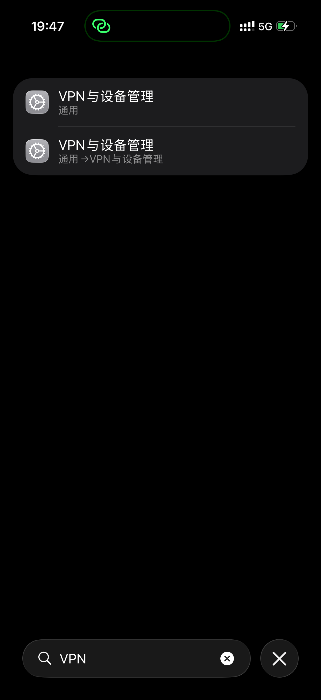

# Day 1：真机控制基线

日期：2026-09-26。PhoneAgent 上游提交：`4f0e201572c2cc6f36bab1e1f80c61878b4a90b7`。

## 实测

| 能力 | 证据摘要 |
|---|---|
| 识别真机 | Xcode 发现 USB 连接的 iPhone 17 Pro；使用实际 UDID |
| 获取 UI Tree | Settings 原生可访问性树；最后连续 5 次验证 `SearchField ... value: VPN` |
| 获取 Screenshot | 官方 `get_screen_image` 返回 1206×2622 PNG |
| 打开 App | `open_app` 打开 `com.apple.Preferences` |
| 点击 | `tap_element` 和 `tap` 均成功，搜索框获得键盘焦点 |
| 输入 | 两次输入 `VPN`，搜索结果出现“VPN与设备管理” |
| 滑动 | `swipe` 将滚动位置从 38% 改为 59%；`scroll` 将其改为 23% |

最终 XCTest 会话 315.694 秒，22 次 CoreDevice 转发连接，1 test / 0 failures；官方 `stop` 后得到 `TEST SUCCEEDED`，端口释放。此次未做长期稳定性和“人机同时使用”的实验。

## 复用位置

- 启动：`PhoneAgent/.agents/skills/phoneagent/scripts/start_rpc_bridge_local.sh`
- 转发：同目录 `forward_rpc_localhost.py`，优先 CoreDevice，回退 usbmux。
- 客户端：同目录 `rpc.py`，逐行 JSON over TCP。
- XCTest 入口：`PhoneAgent/PhoneAgentUITests/PhoneAgentUITests.swift` 中 `testRPCBridge`。
- 服务与动作：`SimulatorRPCServer.swift`、`PhoneAgent.swift`。
- Bridge 模式绕过 API Key 界面，未调用任何模型。

## 遇到的问题

1. 本机 GitHub 直连超时，通过已有系统代理完成下载。
2. 缺少开发签名，由用户配置两个 Target 的 Team 和个人 Bundle IDs。
3. Developer Mode 未开启、开发者证书未信任，均由用户在设备上完成。
4. 一次输入失去焦点，另一次明确因锁屏失败。延长自动锁定时间、保持解锁后，最终完整会话成功。
5. 动画期间树中的坐标可能不稳定；键盘出现后搜索框位置会变化，应重新读取树。坐标使用 points，不是截图像素。

原始日志包含设备和界面信息，仅保留本机。此记录是脱敏摘要；截图仅选用无账号信息的搜索结果页。个人签名修改仍保留在本地 submodule 工作区；其他开发者需自行 Signing。

## 与最终题目的差距

当前实现的 `openApp` 调用 `XCUIApplication.activate()`，点击和文字输入依赖前台应用/键盘，截图来自 `XCUIScreen.main`。它适合验证真机可控，但不能满足用户持续操作时不抢焦点。本次要求用户不碰手机只是基线测试条件，不是最终演示条件。
