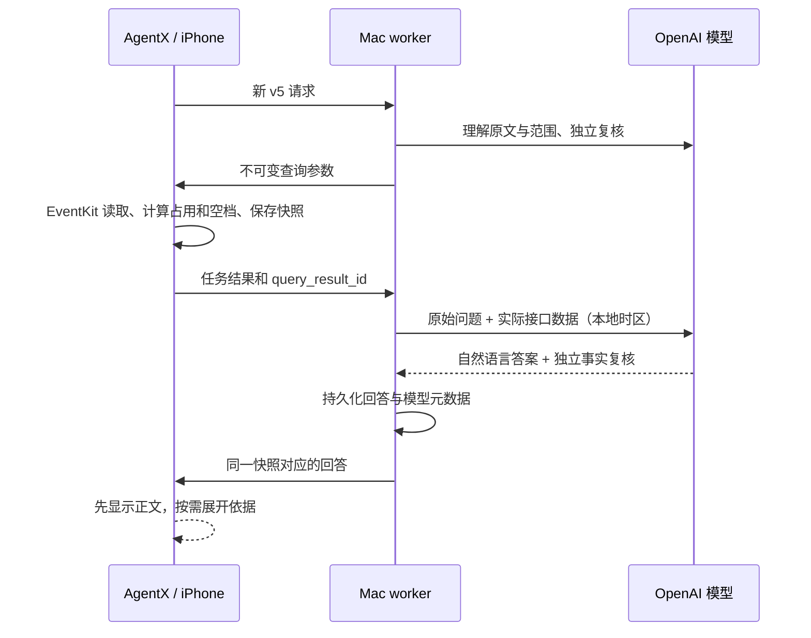

# 接口数据驱动的模型回答

按用户当前选择，新功能采用 **获取真实接口数据 → 连同原始需求交给模型 → 展示模型正文**。不使用代码句式模板拼接回答。当前已接入日历查询；未实现的短信、邮件等不能据此宣称可用。已有创建流程保留真实保存/读回报告，不把历史记录重新交给模型。



`scripts/tool_answer.py` 使用已有 Responses API 适配器与本机配置的模型，默认不变。一次理解/复核共享22秒，读取后的回答/事实复核共享12秒；没有模型循环或自动无界重试。流程遵循 [OpenAI 文档中的应用执行工具、将输出提供给模型再回答的模式](https://developers.openai.com/api/docs/guides/function-calling)，实际工具路由仍由现有白名单 RPC 调度，不伪造模型 function call。

## 数据与事实边界

- 发送本次查询最多100条明细的标题、时间、日历名称、全天/占用标记和原因，最多20个实际候选空档，并提供完整匹配数、截断标志、时区和查询时间。
- 原始 UTC 接口快照保留在执行记录；仅把发给回答模型的时间无损转换为查询时区，附区间分钟数和明细覆盖数，减少重复换算和忽略截断。这些是数据字段，不是预先生成的回答。
- 模型结合用户原话选择回答内容。日历标题等属于数据，不能成为系统指令；回答阶段没有写入/删除等工具。模型正文不触发任何副作用。
- 空档/占用的数学计算仍是可靠接口能力，不交给自然语言输出修改日历。回答复核可能漏错，所以手机保留原始依据，不把模型文字标为系统验证。
- 发送数据给 OpenAI 是本轮用户明确选择的新架构；App 设置、输入页和报告已说明。旧任务不自动上传，无关历史和范围外数据不发送；备注、联系人、事件标识未进入查询答复上下文。
- 本机 `data/` 会含实际数据和模型正文，仅本机保留，不提交 Git。API `store:false` 仅按接口语义使用，不承诺第三方不保留任何日志。

## 状态、恢复与去重

此能力引入时为任务版本5、RPC协议3；当前自动排程版使用任务版本6、RPC协议4，保留同一问答流程。新 App 与 worker 要同时更新；v3/v4 历史计划仍可展示，旧查询没有模型回答。

手机的 `answer_pending` 表示读取已成功、回答待完成；`query_complete` 代表模型正文也已保存；`answer_failed` 表示读取保留但回答失败。`query_result_id` 绑定原始快照。相同正文重复投递是幂等操作，不同正文不能覆盖已持久化回答。

查询响应携带已保存的单任务快照，避免手机刚读完就后台暂停而丢失模型上下文。如果响应丢失，恢复连接后只获取已存快照，不重读 EventKit。Mac 先保存生成正文再投递；投递断连只补送该正文，不重复请求模型。Mac 在模型请求期间崩溃且未保存结果时，报告回答失败，不猜测成功、不自动重试 API。

后台运行仍受原45秒窗口和系统预算限制，没有额外保活。Mac 可以在手机暂停时完成回答，用户回来连接后再同步正文；这不等于手机能无限后台运行。读取失败不发起回答，也不会用模板兜底。

## 验证

```sh
cd AgentX
bash scripts/test.sh
python3 scripts/check_model_answers.py --live
```

自动回归覆盖：只有查询成功才回答；模型确实接收原问题与接口数据；原始快照/本地时区一致；旧任务拒绝导出；回答来源绑定；模型失败及复核拦截无模板；丢失查询响应只取快照；丢失回答响应只补送持久化正文；进程重启不盲目重调用模型。

合成模型测试覆盖节假日+个人安排、个人全天活动、数据截断和恶意事件标题。开发中首轮模型出现 UTC 换算和遗漏记录错误，已增加本地时区表示、覆盖信息和独立回答复核；合成测试结果在 `evidence/model-answer-probes.json`。有限测试不保证模型永远正确。

本轮结果：44项 Python 回归、6组 Swift 校验及2组 EventKit 替身通过，签名构建通过。真实模型的节假日空档、个人全天占用、恶意标题三组生成了与接口一致的答案；截断明细组未通过回答复核，明确失败，未使用模板或宣称回答成功。截断场景仍可能需要用户缩小范围再查询。

2026-09-30 已安装本版 AgentX 并重启独立 Mac 服务。真机 RPC 已确认 `app_id=agentx`、`protocol_version=3`、日历 `full_access`，App 在前台；旧 PhoneAgent 未更新。

用户随后反馈新版已能正确找到空闲时间。此反馈确认了用户可见的查询结果；未额外采集后台性能或录像证据。后续自动排程使用 RPC4/v6，见 [自动排程](automatic-scheduling.md)，不能用查询成功代替排程写入验收。
