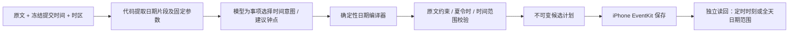

# “下周六”错成“本周六”：根因与修复（历史记录，已回退）

> 2026-09-29：用户要求回到日期修复前版本。本页描述的确定性日期编译器、全天日期适配及相关报告改动已撤回；下文为历史调查和验收记录，不代表当前运行能力。保留日历扩展功能、原始任务与事件。

## 实际证据

任务提交于 **2026-09-29 18:32:32（Asia/Shanghai，周二）**，原文包含“每周五早上……共四次……；下周六到周日全天参加读书营……”。正确活动日期是 **10 月 10–11 日**，排他结束为 **10 月 12 日 00:00**。

Mac 保存的模型原始计划已将读书营开始写成 `2026-10-03T00:00:00+08:00`、结束写成 `2026-10-05T00:00:00+08:00`；手机接收请求没有改日期，系统读回也是 10 月 3–4 日。因此这次一周偏差发生在自然语言理解/日期计算边界，不是 UTC 显示造成的错觉，也不是 EventKit 将日期移了一周。

同时发现另一问题：全天读回的 timeZone 为 nil，结束返回为当地最后一天 23:59:59。旧验证器把全天当作定时事件比较时区和精确时间戳，因而保存成功但报 `saved_unverified`。这与“周六选错”是两个独立问题。原始任务记录与事件 ID 仅保留本机。

## 根因

1. **模型兼任日历计算器。** schema 允许模型直接输出最终 ISO 时间；“下周”与“下一个星期几”的规则只写在提示词里。增加一句提示不能保证每次或混合事项下都正确。
2. **缺少原文约束校验。** 旧验证仅要求日期合法、未来、起止顺序和时区有效。10 月 3 日满足这些条件，却不满足“下周”。
3. **读回核验形成了闭环盲区。** 手机验证的是“实际值等于候选计划”，而候选计划本身可能已经错了。verified 只能证明保存与读回一致，不能反过来证明模型理解正确。
4. **测试覆盖不足。** 单独的全天样例曾通过，但并未把用户的完整混合输入作为稳定回归，也未覆盖提交日、周边界、跨年与时区组合。少量 GPT 成功样例不能作为稳定性保证。
5. **全天语义与时间戳语义混用。** 测试替身原样返回时区和结束值，未覆盖真机观察到的浮动日期/包含式末秒表示。

## 结构性修复



- 新模型 schema 不再允许 `fields.start_at/end_at`。模型输出 `timing`：对原文日期片段的枚举引用、钟点来源、结束模式和重复截止日期引用；代码展开为内部日期意图。
- 原文“下周六”由代码提取为固定的 `week_day / offset=1 / weekday=6` 候选。schema 将证据和参数绑定，防止模型混搭；验证器也检查原文。日期片段保留最长限定范围，不能从“明年十二月三十一日”截取成无年份限定的月日。
- 代码依据**手机原始 submitted_at**转换到事件时区，以周一为周首计算自然周；不使用 worker 当前运行日，也不让重试跨过午夜后改变日期。
- 支持常见绝对公历日期、相对天数、本/下/下下周与星期、月/年日期、重复首次日期、同日起止和跨日范围。全天末日由代码转换为排他结束日。
- 原文与意图矛盾、过去的明确时间、未知关键时间、夏令时不存在/歧义钟点会阻止该项，保留原因；不悄悄移到下周、不自动重试模型。
- 循环的首次发生结束日与整个系列截止日分开计算。每项的时间意图、冻结基准、编译版本、最终日期和失败原因保存在 Mac JSON；手机字段说明显示计算基准与自动补齐来源。
- 全天写入使用浮动日期。读回按当地民用日期范围核验；只接受精确的排他零点或最后一天 23:59:59，保留原始表示及规范化依据。错一天、任意时间差和定时事件不会因该规则被放过。
- UI 将“完整完成”改为“保存且读回一致”，说明核验范围，不把持久化验证包装成自然语言理解保证。

## 验证与部署

```bash
bash scripts/test_alerts.sh
# 冻结为事故提交时间；真实 GPT，仅合成输入，不写手机日历：
python3 scripts/check_temporal_model.py
```

最终自动回归包含 54 项 Python 测试及 Swift 原生/替身校验。六组受支持输入的真实模型结果通过最终编译器重放；农历/调休样例可能返回空列表，此时整份请求明确拒绝，不显示完成（尚未做到该样例逐项保留说明）。

包括原事故完整输入、7×7 提交日/目标星期组合、跨年、UTC 与本地不同日、闰日、月份/年份偏移、同批事项、建议钟点来源、非法意图拦截，以及全天真实读回表示的测试替身回归。最终运行状态见 `evidence/temporal-validation.json`。

新解析用于**新提交的 v3 任务**；旧的不可变计划、旧 JSON 结果、已写入事件不会被重算或覆盖。Mac worker 需要正常重启加载代码；全天核验和报告文案需要更新手机 App。原已创建到错误日期的测试事件仍需单独处理，不能重新执行原任务伪装成修复，以免重复创建。

## 剩余边界

模型仍负责把日期片段归属到正确事项、识别活动和建议钟点；这些语义可能错误，不能承诺任意输入都正确。未支持或不明确的日期表达应保留空缺，不能编造。日期编译器不读取私人日历，也不支持农历、调休与任意复杂日历语言。此轮不改变提醒协议：明确的绝对提醒日期仍有模型解析成分，不声称所有自然语言时间接口都已完全确定化。

Apple 文档说明：[全天/浮动事件起始日期按默认时区返回](https://developer.apple.com/documentation/eventkit/ekevent/startdate)、[nil 时区表示浮动事件](https://developer.apple.com/documentation/eventkit/ekcalendaritem/timezone)。结束末秒表示来自本次真机证据，属于明确测试的兼容处理，不宣称所有日历账户都会如此表示。

## 19:14 真机复验发现的全天写入边界

新任务“下周六到周日全天参加日期修复验收，不用提醒”中，编译器与手机请求均正确给出 10 月 10 日开始、10 月 12 日排他结束；实际手机开始日期正确，但结束读回为当地 10 月 12 日 23:59:59，即额外包含一天。验证器正确拒绝，记录为 `saved_unverified`，没有伪装通过。

此前仅修复全天读回规范化仍不完整：把内部排他结束零点原样赋给浮动全天事件，在此次设备上会将该日期也纳入。原测试替身机械“减一秒”掩盖了写入端行为。现将 **内部排他日期 → 设备时区民用日期 → 前一秒（最后包含日 23:59:59）** 独立放在 EventKit 写入适配层；原始请求不变，读回仍严格比较实际包含日期，不能容忍额外一天。转换不减固定 24 小时，覆盖夏令时日长变化。

测试替身改为按传入结束日期的当天末秒规范化，能够复现此次错误；补充跨时区、单日/多日、夏令时边界及“多一天末秒”拒绝用例。写入记录增加 `date_write_adapter`，可检查具体赋给 EventKit 的时间。已生成的测试事件不自动修改，修正后真机复验状态见 evidence。

## 本轮验收范围确认

用户决定本轮仅以“下周六日期正确”为验收重点，不继续跨天结束边界的复验。已取得的真机结果证实：9 月 29 日提交后，编译结果及 EventKit 实际读回开始日期均为 **10 月 10 日**。原始一周偏差已在该案例中修复。全天结束边界的补充适配已构建、安装，自动测试通过，但尚未取得安装后的新真机任务结果；不能宣称整条多日事件已验证通过。旧测试事件未自动修改或删除。

## 回退部署结果

2026-09-29 21:39（Asia/Shanghai）完成回退构建、手机安装与启动，Mac worker 已重启。手机 RPC 返回 `iphone_native_app`、`full_access`、`foreground`。回退后的 40 项 Python 测试、Swift 校验及四种补丁复现路径通过；模型输出恢复为 start_at/end_at，重复和提醒契约保持。本轮不创建、修改、删除或重放日历事项。回退前源码副本仅保存在已忽略的本机 temporal-artifacts 目录，未包含密钥和个人签名。
